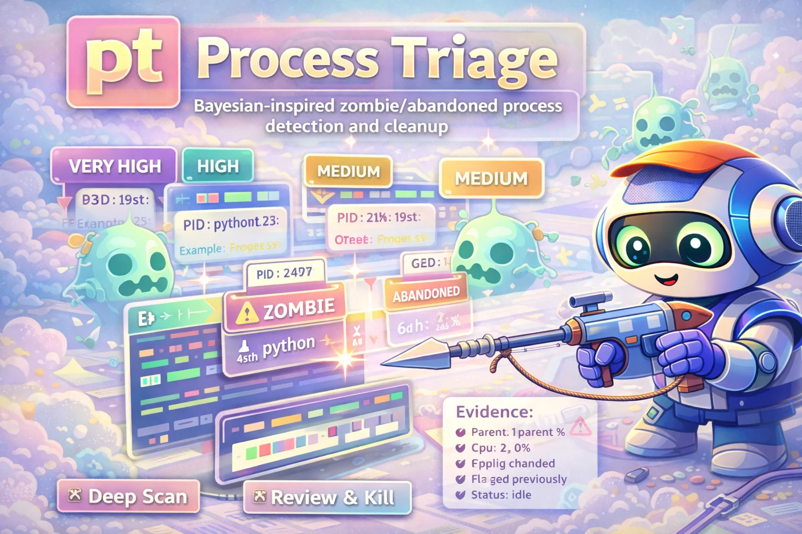

# pt

<div align="center">
  
</div>

<div align="center">

[](./LICENSE)
[](https://github.com/Dicklesworthstone/process_triage/actions/workflows/ci.yml)

</div>

```bash
curl -fsSL https://raw.githubusercontent.com/Dicklesworthstone/process_triage/main/install.sh | bash
```

**`pt` finds and kills zombie processes so you don't have to.** It uses Bayesian inference over 40+ statistical models, provenance-aware blast-radius estimation, and conformal risk control to classify every process on your machine — then tells you exactly *why* it thinks something should die, and exactly *what would break* if you kill it.

---

## The Problem

Development machines accumulate abandoned processes. Stuck `bun test` workers. Forgotten `next dev` servers from last week's branch. Orphaned Claude/Copilot sessions. Build processes that completed but never exited. They silently eat RAM, CPU, and file descriptors until your 64-core workstation grinds to a halt.

Manually hunting them with `ps aux | grep` is tedious, error-prone, and teaches you nothing about whether killing something will break something else.

## The Solution

`pt` automates detection with statistical inference, estimates collateral damage via process provenance graphs, and presents ranked candidates with full evidence transparency:

```bash
$ pt scan
 KILL  PID 84721  bun test          score=87  age=3h22m  cpu=0.0%  mem=1.2GB  orphan
 KILL  PID 71003  next dev          score=72  age=2d4h   cpu=0.1%  mem=340MB  detached
 REVIEW PID 55190 cargo build       score=34  age=45m    cpu=12%   mem=890MB
 SPARE  PID 1204  postgres          protected (infrastructure)
```

## Why pt?

| Feature | `ps aux \| grep` | `htop` | `pt` |
|---------|:-:|:-:|:-:|
| Finds abandoned processes automatically | - | - | Yes |
| Bayesian confidence scoring | - | - | Yes |
| Explains *why* a process is suspicious | - | - | Yes |
| Estimates blast radius before kill | - | - | Yes |
| Learns from your past decisions | - | - | Yes |
| Protected process lists | - | - | Yes |
| Fleet-wide distributed triage | - | - | Yes |
| Conformal FDR control for automation | - | - | Yes |
| Safe kill signals (SIGTERM → SIGKILL) | - | - | Yes |
| Interactive TUI | - | Yes | Yes |

---

## Quick Example

```bash
# Install (one-liner)
curl -fsSL https://raw.githubusercontent.com/Dicklesworthstone/process_triage/main/install.sh | bash

# Interactive mode — scan, review, confirm, kill
pt

# Quick scan — just show candidates, don't kill anything
pt scan

# Deep scan — collect network, I/O, queue depth evidence for higher confidence
pt deep

# Agent/robot mode — structured JSON output for CI/automation
pt agent plan --format json

# Compare two sessions to see what changed
pt diff --last

# Shadow mode — record recommendations without acting (calibration)
pt shadow start
```

---

## Design Philosophy

**1. Conservative by default.** No process is ever killed without explicit confirmation. Robot mode requires 95%+ posterior confidence, passes through conformal prediction gates, and checks blast-radius risk before any automated action.

**2. Transparent decisions.** Every recommendation comes with a full evidence ledger: which features contributed, how much each shifted the posterior, what the Bayes factor is, and what would break if you proceed. No black boxes.

**3. Provenance-aware safety.** `pt` doesn't just check if a process *looks* abandoned — it traces process lineage, maps shared resources (lockfiles, sockets, listeners), estimates direct and transitive blast radius, and blocks kills that would cascade across the system.

**4. Distribution-free guarantees.** Robot mode uses Mondrian conformal prediction to provide finite-sample FDR control. The coverage guarantee `P(Y in C(X)) >= 1-alpha` holds without parametric assumptions, as long as the calibration data is exchangeable with the test distribution.

**5. No mocks, no fakes.** Core inference modules are tested against real system state, not mocked /proc filesystems. If the test passes, the code works on real machines.

---

## Installation

### Quick Install (recommended)

```bash
curl -fsSL https://raw.githubusercontent.com/Dicklesworthstone/process_triage/main/install.sh | bash
```

Installs `pt` (bash wrapper) and `pt-core` (Rust engine) to `~/.local/bin/`.

### Package Managers

```bash
# Homebrew (macOS/Linux)
brew tap process-triage/tap && brew install pt

# Scoop (Windows via WSL2)
scoop bucket add process-triage https://github.com/process-triage/scoop-bucket
scoop install pt

# Winget (Windows native)
winget install --id ProcessTriage.pt --source winget
```

### From Source

```bash
git clone https://github.com/Dicklesworthstone/process_triage.git
cd process_triage
cargo build --release -p pt-core
ln -s "$(pwd)/pt" ~/.local/bin/pt
```

### Verified Install

```bash
# Verify ECDSA signatures + checksums (fail-closed on missing/invalid metadata)
VERIFY=1 curl -fsSL https://raw.githubusercontent.com/Dicklesworthstone/process_triage/main/install.sh | bash
```

**Platforms:** Linux x86_64 (primary), Linux aarch64, macOS x86_64, macOS aarch64, Windows x86_64 (via WSL2/Scoop/Winget)

---

## Quick Start

### 1. Interactive Mode (recommended)

```bash
pt
```

Runs the full triage workflow: **Scan** → **Review** → **Confirm** → **Kill**.

Use `pt run --inline` to preserve terminal scrollback.

### 2. Scan Only

```bash
pt scan        # Quick scan (~1 second)
pt deep        # Deep scan with I/O, network, queue depth probes (~10-30 seconds)
```

### 3. Agent/Robot Mode

```bash
pt agent plan --format json       # Structured JSON plan
pt agent plan --format toon       # Token-optimized output
pt agent apply --session <id>     # Execute a plan
pt agent verify --session <id>    # Confirm outcomes
pt agent watch --format jsonl     # Stream events
```

### 4. Shadow Mode (calibration)

```bash
pt shadow start                   # Observe without acting
pt shadow report -f md            # ASCII calibration report
pt shadow stop                    # Stop observer
```

---

## Command Reference

| Command | Description | Example |
|---------|-------------|---------|
| `pt` | Interactive triage (scan + review + kill) | `pt` |
| `pt run --inline` | Interactive with preserved scrollback | `pt run --inline` |
| `pt scan` | Quick scan, show candidates | `pt scan` |
| `pt deep` | Deep scan with extra probes | `pt deep` |
| `pt agent plan` | Generate structured plan | `pt agent plan --format json` |
| `pt agent apply` | Execute a plan | `pt agent apply --session <id>` |
| `pt agent verify` | Confirm outcomes | `pt agent verify --session <id>` |
| `pt agent watch` | Stream events | `pt agent watch --format jsonl` |
| `pt agent report` | Generate HTML report | `pt agent report --session <id>` |
| `pt diff` | Compare two sessions | `pt diff --last` |
| `pt learn` | Interactive tutorials | `pt learn list` |
| `pt bundle create` | Export session bundle | `pt bundle create --session <id> --output out.ptb` |
| `pt report` | HTML report from session | `pt report --session <id> --output report.html` |
| `pt shadow start` | Start calibration observer | `pt shadow start` |
| `pt config validate` | Validate config files | `pt-core config validate policy.json` |
| `pt --version` | Show version | `pt --version` |
| `pt --help` | Full help | `pt --help` |

---

## Core Concepts

### Four-State Classification

Every process is classified into one of four states via Bayesian posterior updates:

| State | Description | Typical Action |
|-------|-------------|----------------|
| **Useful** | Actively doing productive work | Leave alone |
| **Useful-Bad** | Running but stalled, leaking, or deadlocked | Throttle, review |
| **Abandoned** | Was useful, now forgotten | Kill (usually recoverable) |
| **Zombie** | Terminated but not reaped by parent | Clean up |

### Evidence Sources

| Evidence | What It Measures | Impact |
|----------|------------------|--------|
| CPU activity | Active computation vs idle | Idle + old = suspicious |
| Runtime vs expected lifetime | Overdue processes | Long-running test = likely stuck |
| Parent PID | Orphaned (PPID=1)? | Orphans are suspicious |
| I/O activity | Recent file/network I/O | No I/O for hours = abandoned |
| TTY state | Interactive or detached? | Detached old processes = suspicious |
| Network queues | Socket rx/tx queue depth | Deep queues = stalled (useful-bad) |
| Command category | Test runner, dev server, build tool? | Sets prior expectations |
| Past decisions | Have you spared similar processes? | Learns from your patterns |

### Confidence Levels

| Level | Posterior | Robot Mode |
|-------|-----------|------------|
| `very_high` | > 0.99 | Auto-kill eligible |
| `high` | > 0.95 | Auto-kill eligible |
| `medium` | > 0.80 | Requires confirmation |
| `low` | < 0.80 | Review only |

---

## Safety Model

### Identity Validation

Every kill target is verified by a triple `<boot_id>:<start_time_ticks>:<pid>` that prevents PID-reuse attacks, stale plan execution, and race conditions.

### Protected Processes

These are **never** flagged: `systemd`, `dbus`, `sshd`, `cron`, `docker`, `containerd`, `postgres`, `mysql`, `redis`, `nginx`, `apache`, `caddy`, and any root-owned process. Configurable via `policy.json`.

### Staged Kill Signals

1. **SIGTERM** — graceful shutdown request
2. **Wait** — configurable timeout for cleanup
3. **SIGKILL** — forced termination if SIGTERM fails

### Provenance-Aware Blast Radius

`pt` goes beyond simple process metrics. It builds a **shared-resource graph** mapping which processes share lockfiles, sockets, listeners, and pidfiles. Before any kill, it estimates:

- **Direct impact**: co-holders of shared resources, supervised processes, children
- **Indirect impact**: transitive dependencies via BFS with confidence decay
- **Risk classification**: Low / Medium / High / Critical

```
blast_radius:
  risk_level: Medium
  total_affected: 3
  risk_score: 0.35
  direct: "shares 2 resource(s) with 3 process(es), owns 1 active listener(s)"
  counterfactual: "Killing would affect 3 other processes"
```

High-risk kills require confirmation. Critical-risk kills are blocked in robot mode.

### Robot/Agent Safety Gates

| Gate | Default | Purpose |
|------|---------|---------|
| `min_posterior` | 0.95 | Minimum Bayesian confidence |
| `conformal_alpha` | 0.05 | FDR control via Mondrian conformal prediction |
| `max_blast_radius` | Critical | Block kills above this risk level |
| `max_kills` | 10 | Per-session kill limit |
| `fdr_budget` | 0.05 | e-value Benjamini-Hochberg correction |
| `causal_snapshot` | Complete | Require fleet-wide consistent cut |
| `protected_patterns` | (see above) | Always enforced |

---

## Architecture

```
pt (Bash wrapper)
 └─ pt-core (Rust binary, 8 crates, 100+ modules)
     ├─ Collect ─────── /proc parsing, network queues, cgroup limits,
     │                  GPU detection, systemd units, containers,
     │                  lockfile/pidfile ownership, workspace resolver,
     │                  shared-resource graph, provenance continuity
     │
     ├─ Infer ──────── Bayesian posteriors (log-domain), BOCPD, HSMM,
     │                  Kalman filters, conformal prediction (Mondrian),
     │                  queueing-theoretic stall detection (M/M/1 + EWMA),
     │                  belief propagation, Hawkes processes, EVT,
     │                  martingale testing, context-tree weighting
     │
     ├─ Decide ─────── Expected-loss minimization, FDR control (eBH/eBY),
     │                  Value of Information, active sensing, CVaR,
     │                  distributionally robust optimization,
     │                  blast-radius estimation, provenance scoring,
     │                  causal snapshots (Chandy-Lamport), Gittins indices
     │
     ├─ Act ────────── SIGTERM → SIGKILL escalation, cgroup throttle,
     │                  cpuset quarantine, renice, process freeze,
     │                  recovery trees, rollback on failure
     │
     └─ Report ─────── JSON/TOON/HTML output, evidence ledger,
                        Galaxy-Brain cards, provenance explanations,
                        counterfactual stories, session bundles
```

### Workspace Structure

```
process_triage/
├── Cargo.toml                     # Workspace root
├── pt                             # Bash wrapper
├── install.sh                     # Installer + ECDSA verification
├── crates/
│   ├── pt-core/                   # Main engine (41 inference + 40 decision + 25 collect modules)
│   ├── pt-common/                 # Shared types, evidence schemas, provenance IDs
│   ├── pt-config/                 # Configuration loading, priors, policy validation
│   ├── pt-math/                   # Log-domain arithmetic, numerical stability
│   ├── pt-bundle/                 # Session bundles (ZIP + ChaCha20-Poly1305 encryption)
│   ├── pt-redact/                 # HMAC hashing, PII scrubbing, redaction profiles
│   ├── pt-telemetry/              # Arrow schemas, Parquet writer, LMAX disruptor
│   └── pt-report/                 # HTML report templating (Askama + minify-html)
├── test/                          # BATS test suite
├── docs/                          # User + architecture documentation
│   └── math/PROOFS.md             # Formal mathematical guarantees
├── examples/configs/              # Scenario configurations
├── fuzz/                          # Fuzz testing targets
└── benches/                       # Criterion benchmarks
```

---

## Configuration

### Directory Layout

```
~/.config/process_triage/
├── decisions.json                # Learned kill/spare decisions
├── priors.json                   # Bayesian hyperparameters
├── policy.json                   # Safety policy
└── triage.log                    # Audit log

~/.local/share/process_triage/
└── sessions/
    └── pt-20260115-143022-a7xq/
        ├── manifest.json
        ├── snapshot.json
        ├── provenance.json       # Process provenance graph
        ├── plan.json
        └── audit.jsonl
```

### Environment Variables

| Variable | Default | Description |
|----------|---------|-------------|
| `PROCESS_TRIAGE_CONFIG` | `~/.config/process_triage` | Config directory |
| `PROCESS_TRIAGE_DATA` | `~/.local/share/process_triage` | Data/session directory |
| `PT_OUTPUT_FORMAT` | (unset) | Default output format (`json`, `toon`) |
| `NO_COLOR` | (unset) | Disable colored output |
| `PROCESS_TRIAGE_RETENTION` | `7` | Session retention in days |
| `PROCESS_TRIAGE_NO_PERSIST` | (unset) | Disable session persistence |
| `PT_BUNDLE_PASSPHRASE` | (unset) | Default bundle encryption passphrase |

### Priors Configuration (`priors.json`)

```json
{
  "schema_version": "1.0.0",
  "classes": {
    "useful":    { "prior_prob": 0.70, "cpu_beta": {"alpha": 5.0, "beta": 3.0} },
    "useful_bad":{ "prior_prob": 0.05, "cpu_beta": {"alpha": 2.0, "beta": 4.0},
                   "queue_saturation_beta": {"alpha": 6.0, "beta": 1.0} },
    "abandoned": { "prior_prob": 0.15, "cpu_beta": {"alpha": 1.0, "beta": 5.0} },
    "zombie":    { "prior_prob": 0.10, "cpu_beta": {"alpha": 1.0, "beta": 9.0} }
  }
}
```

See [docs/PRIORS_SCHEMA.md](docs/PRIORS_SCHEMA.md) for the full specification.

### Policy Configuration (`policy.json`)

```json
{
  "protected_patterns": ["systemd", "sshd", "docker", "postgres"],
  "min_process_age_seconds": 3600,
  "robot_mode": {
    "enabled": false,
    "min_posterior": 0.99,
    "max_blast_radius_mb": 2048,
    "max_kills": 5
  }
}
```

---

## Telemetry and Data Governance

All data stays local. Nothing is sent anywhere.

| Data | Purpose | Retention |
|------|---------|-----------|
| Process metadata | Classification input | Session lifetime |
| Evidence samples | Audit trail | Configurable (default: 7 days) |
| Kill/spare decisions | Learning | Indefinite (user-controlled) |
| Provenance graphs | Blast-radius estimation | Session lifetime |
| Session manifests | Reproducibility | Configurable (default: 30 days) |

### Redaction

Sensitive data is hashed/redacted before persistence. Four profiles: `minimal` (hashes only), `standard` (redacted paths), `debug` (full detail, local only), `share` (anonymized for export).

See [docs/PROVENANCE_PRIVACY_MODEL.md](docs/PROVENANCE_PRIVACY_MODEL.md) and [docs/PROVENANCE_CONTROLS_AND_ROLLOUT.md](docs/PROVENANCE_CONTROLS_AND_ROLLOUT.md).

---

## Session Bundles and Reports

### Encrypted Session Bundles (`.ptb`)

```bash
# Export a session
pt bundle create --session <id> --profile safe --output session.ptb

# With encryption (ChaCha20-Poly1305 + PBKDF2)
pt bundle create --session <id> --encrypt --passphrase "correct horse battery staple"
```

### HTML Reports

```bash
pt report --session <id> --output report.html
pt report --session <id> --output report.html --include-ledger --embed-assets
```

---

## Fleet Mode

`pt` supports multi-host triage with distributed safety guarantees:

```bash
# Scan a fleet of hosts via SSH
pt-core fleet scan --inventory hosts.toml --parallel 10

# Pooled FDR control across hosts (e-value Benjamini-Yekutieli)
pt-core fleet plan --fdr-method eby --alpha 0.05
```

Fleet mode uses **Chandy-Lamport consistent snapshots** to prevent triage cascades: a process on Host A won't be killed if it's a dependency of a Useful process on Host B. Tentative hosts (timeout/unreachable) trigger conservative fallback — no auto-kills until the cut is complete.

---

## Mathematical Foundations

The inference engine is backed by formal mathematical guarantees documented in [docs/math/PROOFS.md](docs/math/PROOFS.md):

| Guarantee | Method | Invariant |
|-----------|--------|-----------|
| Posterior sums to 1 | Log-sum-exp normalization | `sum P(C\|x) = 1` |
| FDR control | e-value eBH/eBY | `E[FDP] <= alpha` |
| Coverage | Mondrian conformal prediction | `P(Y in C(X)) >= 1-alpha` |
| Numerical stability | Log-domain arithmetic | No overflow/underflow |
| Queue stall detection | M/M/1 queueing theory | `P(N >= L) = rho^L` |
| Fleet safety | Chandy-Lamport snapshots | No kills on invalid cut |

---

## Troubleshooting

### "gum: command not found"

```bash
# Debian/Ubuntu
sudo mkdir -p /etc/apt/keyrings
curl -fsSL https://repo.charm.sh/apt/gpg.key | sudo gpg --dearmor -o /etc/apt/keyrings/charm.gpg
echo "deb [signed-by=/etc/apt/keyrings/charm.gpg] https://repo.charm.sh/apt/ * *" | sudo tee /etc/apt/sources.list.d/charm.list
sudo apt update && sudo apt install gum

# macOS
brew install gum
```

### "No candidates found"

Expected on clean systems! `pt` won't invent problems. Check: minimum age threshold is 1 hour by default. To lower it:

```bash
pt agent plan --min-age 60  # 1 minute instead of 1 hour
```

### Permission errors

```bash
sudo setcap cap_sys_ptrace=ep $(which pt-core)  # Grant /proc access
sudo pt deep                                      # Or run elevated
```

### "pt-core not found"

```bash
curl -fsSL https://raw.githubusercontent.com/Dicklesworthstone/process_triage/main/install.sh | bash
ls -la ~/.local/bin/pt-core
```

### TUI won't run

The TUI requires building with `--features ui`:

```bash
cargo run -p pt-core --features ui -- run
```

---

## Limitations

- **Linux-first**: Deep scan features (`/proc` parsing, cgroup limits, io_uring probes) require Linux. macOS has basic collection via `ps`/`lsof`.
- **No Windows native**: Windows support is via WSL2 only.
- **Calibration needed**: Conformal prediction gates require 20+ human-reviewed calibration samples before they activate. Until then, robot mode uses posterior-only gating.
- **Single-machine focus**: Fleet mode exists but is newer and less battle-tested than single-host triage.
- **No automatic recovery**: `pt` kills processes but doesn't restart them. If the process has a supervisor (systemd, Docker), the supervisor handles restart.

---

## FAQ

**Q: Will `pt` ever kill something it shouldn't?**
By design, no. Interactive mode always asks for confirmation. Robot mode requires 95%+ posterior confidence, passes through conformal FDR control, and checks blast-radius risk. Protected processes are never flagged regardless of score.

**Q: How does it learn from my decisions?**
Kill/spare decisions are saved to `decisions.json`. When `pt` sees a similar command pattern again, it adjusts the prior based on your past choices.

**Q: Does it phone home?**
No. All data stays on your machine. No telemetry, no analytics, no network calls (except `install.sh` downloading the binary).

**Q: Can I use it in CI/CD?**
Yes. `pt agent plan --format json` produces structured output with exit codes. Set `robot_mode.enabled = true` in `policy.json` and configure safety gates appropriately.

**Q: What's the "Galaxy-Brain" mode?**
The evidence ledger's detailed view that shows every Bayes factor, every evidence term contribution, and the full posterior computation. Available via `pt deep` or `pt agent plan --deep --format json`.

**Q: How is this different from `kill -9`?**
`pt` tells you *what* to kill and *why*, with confidence scores and impact estimates. It also uses staged signals (SIGTERM first), validates process identity to prevent PID-reuse mistakes, and logs everything for audit.

---

## About Contributions

Please don't take this the wrong way, but I do not accept outside contributions for any of my projects. I simply don't have the mental bandwidth to review anything, and it's my name on the thing, so I'm responsible for any problems it causes; thus, the risk-reward is highly asymmetric from my perspective. I'd also have to worry about other "stakeholders," which seems unwise for tools I mostly make for myself for free. Feel free to submit issues, and even PRs if you want to illustrate a proposed fix, but know I won't merge them directly. Instead, I'll have Claude or Codex review submissions via `gh` and independently decide whether and how to address them. Bug reports in particular are welcome. Sorry if this offends, but I want to avoid wasted time and hurt feelings. I understand this isn't in sync with the prevailing open-source ethos that seeks community contributions, but it's the only way I can move at this velocity and keep my sanity.

---

## Origins

Created by **Jeffrey Emanuel** after a session where 23 stuck `bun test` workers and a 31GB Hyprland instance brought a 64-core workstation to its knees. Manual process hunting is tedious — statistical inference should do the work.

---

## License

MIT License (with OpenAI/Anthropic Rider) — see [LICENSE](LICENSE) for details.

---

<div align="center">

Built with Rust, Bash, and hard-won frustration.

[Documentation](docs/) · [Agent Guide](docs/AGENT_INTEGRATION_GUIDE.md) · [Math Proofs](docs/math/PROOFS.md) · [Issues](https://github.com/Dicklesworthstone/process_triage/issues)

</div>
