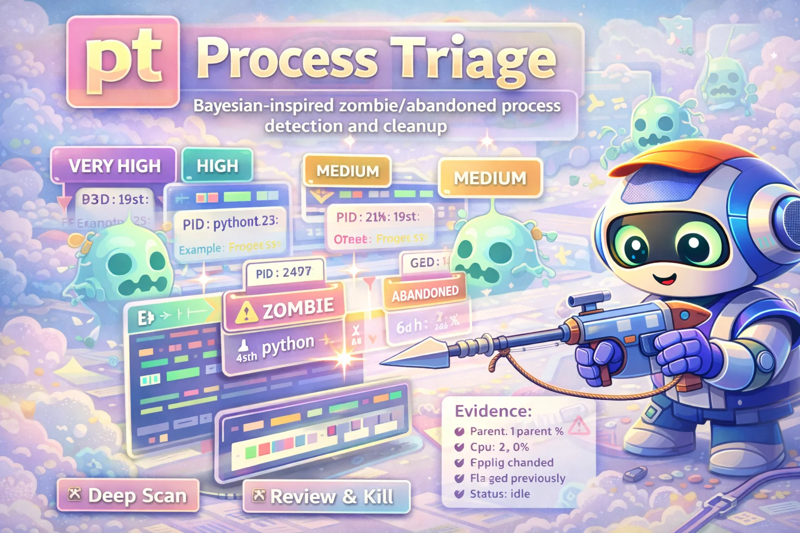

# pt

<div align="center">
  
</div>

<div align="center">

[](./LICENSE)

</div>

```bash
curl -fsSL https://raw.githubusercontent.com/Dicklesworthstone/process_triage/main/install.sh | bash
```

**`pt` finds abandoned processes and helps you get rid of them safely.** It scores every process with a Bayesian posterior (CPU, age, orphan status, terminal, state, plus process lineage and shared resources on Linux), refuses to touch live infrastructure (multiplexers, SSH masters, databases, agent sessions, your own shell), and tells you *why* each candidate looks abandoned. It is deliberately conservative: most candidates come back as `review` or `pause`, and a `kill` recommendation needs overwhelming evidence.

---

## The Problem

Development machines accumulate abandoned processes. Stuck `bun test` workers. Forgotten `next dev` servers from last week's branch. Orphaned Claude/Copilot sessions. Build processes that completed but never exited. They silently eat RAM, CPU, and file descriptors until your 64-core workstation grinds to a halt.

Manually hunting them with `ps aux | grep` is tedious, error-prone, and teaches you nothing about whether killing something will break something else.

## The Solution

`pt` automates detection with statistical inference, skips protected processes before scoring, and presents ranked candidates with the evidence behind each score (`pt` opens the TUI; `pt agent plan` gives the same ranking as JSON):

```text
 SCORE  ACTION  PID     AGE    CPU   MEM     COMMAND
   85   pause   412233  260h   0.0%  12MB    python3 -m http.server 61493 --bind 127.0.0.1   (orphan)
   83   review  90121   211h   0.2%  134MB   chrome --headless ...                            (orphan)
   46   review  48758   1h     0.0%  1MB     sleep 8888                                       (orphan)
        spare   1204            protected: builtin.service_daemon (postgres)
```

The score is 100 × P(abandoned or zombie). The action is the one with the lowest expected loss under the policy's loss matrix, which makes `kill` rare by design (see [the 8 actions](#the-8-actions)).

## Why pt?

| Feature | `ps aux \| grep` | `htop` | `pt` |
|---------|:-:|:-:|:-:|
| Finds abandoned processes automatically | - | - | Yes |
| Bayesian confidence scoring | - | - | Yes |
| Explains *why* a process is suspicious | - | - | Yes |
| Estimates blast radius before kill (Linux) | - | - | Yes |
| Learns from your past decisions | - | - | Yes |
| Built-in protection for live infrastructure | - | - | Yes |
| Fleet-wide planning over SSH | - | - | Yes |
| Guardrails for automation (posterior, RSS, kill caps, live pre-checks) | - | - | Yes |
| Safe kill signals (SIGTERM → SIGKILL) | - | - | Yes |
| Interactive TUI | - | Yes | Yes |

---

## Quick Example

```bash
# Install (one-liner)
curl -fsSL https://raw.githubusercontent.com/Dicklesworthstone/process_triage/main/install.sh | bash

# Interactive mode — scan, review, confirm, kill
pt

# Scored candidates without acting (JSON; what agents and scripts use)
pt agent plan --format json

# Raw process snapshot / raw deep /proc records (no scoring)
pt scan
pt deep

# Compare two sessions to see what changed
pt diff --last

# Shadow mode — record recommendations without acting (calibration)
pt shadow start
```

---

## Design Philosophy

**1. Conservative by default.** No process is ever killed without explicit confirmation. Robot mode is off unless enabled in policy, needs `--yes`, a posterior of at least `min_posterior` (0.95) for the event that justifies the action, per-action and total RSS limits, a kill cap, and live pre-checks (identity, protection, session safety, data-loss gate) immediately before acting.

**2. Transparent decisions.** Every recommendation comes with its evidence: which features contributed, how much each shifted the posterior, and the expected loss of every action (`pt agent explain --galaxy-brain`, the TUI detail pane, `pt report --include-ledger`).

**3. Protection before scoring.** Terminal multiplexers, SSH ControlMasters, session infrastructure, interactive shells, database/web servers and their workers, pt's own caller chain, systemd/container-supervised services, and on macOS system and app-bundle processes are never candidates. AI agent CLIs are only ever shown for review.

**4. Real processes in tests.** Parsers, collectors and the action layer are tested against real /proc and real spawned processes; a live read-only fleet gate (`scripts/fleet_reality_e2e.py`) checks plans on real hosts. Some higher-level tests use synthetic process builders.

---

## How It Actually Works

### The Inference Pipeline

Every process on your system passes through a five-stage pipeline:

```
          ┌─────────┐     ┌─────────┐     ┌─────────┐     ┌─────────┐     ┌─────────┐
 /proc ──→│ Collect │────→│  Infer  │────→│ Decide  │────→│   Act   │────→│ Report  │
          └─────────┘     └─────────┘     └─────────┘     └─────────┘     └─────────┘
           25 modules      41 modules      40 modules      13 modules      5 formats
```

**Collect** takes a process snapshot (`ps` plus exact start times from `/proc` or `proc_pidinfo`), cgroup placement, and on Linux process lineage and a shared-resource graph (listeners, sockets, lockfiles).

**Infer** computes a 4-class posterior (useful, useful-but-bad, abandoned, zombie) by naive Bayes over CPU occupancy, age, orphan status, controlling terminal and kernel state, with each term clipped and tempered so no single signal dominates. On Linux, lineage and shared-resource evidence add terms; signature matches and your own past verdicts (`pt agent label`, TUI kills) set the prior. The TUI also uses deep network/I/O evidence when it collects it.

**Decide** picks the action with the lowest expected loss under the policy's loss matrix, among the actions feasible for the process state, then applies protection, supervision and policy enforcement. Rather than a binary kill/spare, it evaluates Keep, Renice, Pause, Freeze, Throttle, Quarantine, Restart and Kill.

**Act** re-verifies identity (exact start time; a pidfd on Linux) and runs live pre-checks immediately before each signal, then escalates SIGTERM → SIGKILL. Renice, pause/resume and kill run on Linux and macOS; freeze, throttle and quarantine are Linux-only and refused unless the target owns its cgroup. Failures are reported; there is no automatic rollback.

**Report** produces JSON, TOON (token-optimized), Markdown, HTML reports, or the interactive TUI, with the evidence ledger and Bayes factors.

### Experimental Library Models

The workspace also ships these models as tested library code. **None of them is wired into `agent plan`, the TUI, or `agent apply` yet**; they are candidates to be added only where they measurably improve decisions:

| Model | What It Detects | How It Works |
|-------|----------------|--------------|
| **BOCPD** | Sudden behavior changes | Bayesian Online Change-Point Detection with run-length recursion |
| **HSMM** | State transitions with duration | Hidden Semi-Markov Model with Gamma-distributed dwell times |
| **IMM** | Regime switching | Interacting Multiple Model filter bank with Markov transitions |
| **Kalman** | Trend estimation | Scalar Kalman filter + Rauch-Tung-Striebel backward smoother |
| **CTW** | Sequential prediction | Context Tree Weighting with Krichevsky-Trofimov estimator |
| **Hawkes** | Burst detection | Self-exciting point process (branching ratio n=alpha/beta) |
| **EVT/GPD** | Tail risk | Extreme Value Theory with Generalized Pareto Distribution |
| **Conformal** | Distribution-free coverage | Mondrian split conformal with blocked + adaptive variants |
| **Martingale** | Anytime-valid testing | Azuma-Hoeffding + Freedman/Bernstein bounds |
| **Wasserstein** | Distribution drift | 1D earth-mover's distance for non-stationarity detection |
| **M/M/1 Queue** | Socket stall detection | EWMA-smoothed queue depth with logistic rho estimation |
| **Compound Poisson** | Bursty I/O | Markov-modulated Levy subordinator |
| **Belief Prop** | Hierarchical inference | Message-passing over process lineage trees |
| **Robust Bayes** | Model misspecification | Credal sets + Safe-Bayes eta-tempering |
| **BMA** | Model uncertainty | Bayesian Model Averaging across competing posteriors |
| **Sketches** | Heavy hitters | Count-Min Sketch + T-Digest + Space-Saving for pattern detection |

All computation happens in log-domain using numerically stable log-sum-exp to prevent overflow/underflow.

### The 8 Actions

Most tools only know "kill" or "don't kill." `pt` evaluates 8 possible actions ranked by expected loss:

| Action | Signal/Mechanism | Reversible | Executes on |
|--------|-----------------|:--:|-----------|
| **Keep** | No action | Yes | - |
| **Renice** | lower priority (`nice`), never raises it | Yes | Linux, macOS |
| **Pause** | `SIGSTOP` (resume: `SIGCONT`) | Yes | Linux, macOS |
| **Freeze** | cgroup v2 freezer | Yes | Linux, if the target owns its cgroup |
| **Throttle** | cgroup CPU quota | Yes | Linux, if the target owns its cgroup |
| **Quarantine** | cpuset controller | Yes | Linux, if the target owns its cgroup |
| **Restart** | via the supervisor | Partial | not executable yet (planned, e.g. for a zombie's parent); apply reports it as failed |
| **Kill** | SIGTERM → SIGKILL | No | Linux, macOS |

**Why `kill` is rare.** The default loss matrix makes killing a useful process 500 times worse than leaving an abandoned one paused, so `kill` wins only when P(useful) is below about 0.7% of P(abandoned). The posterior is deliberately conservative, so on real machines idle orphans usually come back as `pause` or `review`. Your own verdicts (`pt agent label --kill`) raise the prior for a command pattern; the loss matrix is configurable in `policy.json`.

### Evidence Collection: What /proc Files Are Parsed

On Linux, `pt deep` reads 12+ files per process (raw records; the TUI turns network/I/O activity into evidence terms, `agent plan` does not yet use them):

| File | Data Extracted |
|------|---------------|
| `/proc/[pid]/stat` | PID, PPID, state, utime, stime, starttime, vsize, rss, num_threads |
| `/proc/[pid]/io` | rchar, wchar, syscr, syscw, read_bytes, write_bytes |
| `/proc/[pid]/fd/` | Open file descriptors with type (socket, pipe, file, device) |
| `/proc/[pid]/schedstat` | CPU time, wait time, timeslices |
| `/proc/[pid]/sched` | Voluntary/involuntary context switches, priority |
| `/proc/[pid]/statm` | Memory pages (size, resident, shared, text, data) |
| `/proc/[pid]/cgroup` | cgroup v1/v2 paths, CPU/memory limits |
| `/proc/[pid]/wchan` | Kernel wait channel (detects D-state processes) |
| `/proc/[pid]/environ` | Environment variables (for workspace/supervisor detection) |
| `/proc/net/tcp` | TCP connections with tx_queue/rx_queue depths |
| `/proc/net/udp` | UDP socket state |
| `/proc/net/unix` | Unix domain sockets with reference counts |

Critical file detection recognizes 20+ patterns: git locks (`.git/index.lock`), package manager locks (dpkg, apt, rpm, npm, pnpm, yarn, cargo), SQLite WAL/journal files, database write handles, and generic `.lock`/`.lck` files. At apply time the data-loss gate blocks any target holding a regular file open for writing or a file lock; the categorized critical-file rules are not yet attached to plans.

### The TUI

The interactive TUI is built on **ftui** (an Elm-style Model-View-Update framework for terminals):

- **Responsive layout**: adapts to terminal width with breakpoints at 80/120/200 columns (single-panel, two-pane, three-pane)
- **Process table**: sortable by score, age, CPU, memory, with live filtering via search input
- **Detail panel**: expanded evidence view for the selected process including Bayes factors, evidence term glyphs, and decision rationale
- **Command palette**: fuzzy-searchable action palette for power users
- **Inline mode** (`pt run --inline`): confines the UI to a bottom region, preserving terminal scrollback above

From source: `cargo run -p pt-core -- run` (the `ui` feature is on by default).

### Session Diffing

`pt diff --last` compares two scan snapshots and classifies every process into lifecycle transitions:

| Transition | Meaning |
|------------|---------|
| `Appeared` | New process since last scan |
| `Resolved` | Process exited since last scan |
| `Stable` | Same classification and score |
| `NewlyOrphaned` | Parent died, process adopted by init |
| `Reparented` | Process moved to a new parent |
| `StateChanged` | Classification changed (e.g., Useful → Abandoned) |
| `OwnershipChanged` | User or group changed |

Each delta includes `score_drift` (how much the score changed), `worsened`/`improved` flags, and continuity confidence.

### MCP Server

`pt` includes a Model Context Protocol server for AI agent integration:

```bash
pt-core mcp   # Start JSON-RPC 2.0 server over stdio
```

Available tools:

- `pt_plan`: the same engine, protections and output as `pt agent plan --format json`.
- `pt_scan`: a process listing with signature-match scores.
- `pt_explain`: a PID's evidence.
- `pt_history`: recent sessions.
- `pt_signatures`
- `pt_capabilities`

AI agents can use these to query process state, run scans, and make triage decisions without CLI parsing.

### Learning Tutorials

```bash
pt learn list              # Show available tutorials
pt learn show 01           # Read a tutorial
pt learn verify --all      # Verify completion
```

Built-in tutorials cover first-run safety, stuck test runners, port conflicts, agent workflow, fleet operations, shadow mode, and deep scanning. `pt learn verify` smoke-runs each tutorial's commands under a time budget to check they still work.

---

## Installation

### Quick Install (recommended)

```bash
curl -fsSL https://raw.githubusercontent.com/Dicklesworthstone/process_triage/main/install.sh | bash
```

Installs `pt` (bash wrapper) and `pt-core` (Rust engine) to `~/.local/bin/`.

### Package Managers

There is no Homebrew formula, Scoop manifest, or winget package for `pt` yet.
Use the install script above (it works on macOS and Linux, and inside WSL2 on
Windows), or build from source below.

### From Source

```bash
git clone https://github.com/Dicklesworthstone/process_triage.git
cd process_triage
cargo build --release -p pt-core
ln -s "$(pwd)/pt" ~/.local/bin/pt
```

### Verified Install

```bash
# Verify ECDSA signatures + checksums (fail-closed on missing/invalid metadata).
# Pass --verify to bash (a `VERIFY=1 curl ... | bash` prefix only reaches curl).
curl -fsSL https://raw.githubusercontent.com/Dicklesworthstone/process_triage/main/install.sh | bash -s -- --verify
```

Releases up to v2.1.0 were published without signatures, so a verified install of them fails closed ("does not publish release-signing-public.pem") and installs nothing. `pt update` verifies by default and says so when it refuses; `pt update --no-verify` installs unverified on explicit request.

**Platforms:** Linux x86_64 (primary), Linux aarch64, macOS x86_64, macOS aarch64, Windows x86_64 (via WSL2 only, using the Linux install)

---

## Quick Start

### 1. Interactive Mode (recommended)

```bash
pt
```

Runs the full triage workflow: **Scan** → **Review** → **Confirm** → **Kill**.

Use `pt run --inline` to preserve terminal scrollback.

### 2. Scored Candidates Without Acting

```bash
pt agent plan --format json                 # ranked candidates, evidence, recommended actions
pt agent explain --session <id> --pids 1234 # why one process scored the way it did
```

`pt scan` and `pt deep` print raw process snapshots (JSON by default), not scores.

### 3. Agent/Robot Mode

```bash
pt agent plan --format json            # Structured JSON plan
pt agent plan --format toon            # Token-optimized output
pt agent apply --session <id> --yes    # Execute a plan (needs robot_mode.enabled=true in policy)
pt agent verify --session <id>         # Confirm outcomes
pt agent label --pid 1234 --kill       # Teach pt your verdict for this command pattern
pt agent watch --format jsonl          # Stream events
```

### 4. Shadow Mode (calibration)

```bash
pt shadow start                   # Observe without acting
pt shadow report -f md            # ASCII calibration report
pt shadow stop                    # Stop observer
```

---

## Command Reference

| Command | Description | Example |
|---------|-------------|---------|
| `pt` | Interactive triage (scan + review + kill) | `pt` |
| `pt run --inline` | Interactive with preserved scrollback | `pt run --inline` |
| `pt scan` | Raw process snapshot (no scoring) | `pt scan` |
| `pt deep` | Raw deep /proc records (Linux) | `pt deep` |
| `pt agent plan` | Scored, ranked candidates + plan | `pt agent plan --format json` |
| `pt agent explain` | Evidence for specific PIDs | `pt agent explain --session <id> --pids 1234` |
| `pt agent label` | Record your kill/spare verdict | `pt agent label --pid 1234 --spare` |
| `pt agent apply` | Execute a plan (robot mode) | `pt agent apply --session <id> --yes` |
| `pt agent verify` | Confirm outcomes | `pt agent verify --session <id>` |
| `pt agent watch` | Stream events | `pt agent watch --format jsonl` |
| `pt agent report` | Generate HTML report | `pt agent report --session <id>` |
| `pt diff` | Compare two sessions | `pt diff --last` |
| `pt learn` | Interactive tutorials | `pt learn list` |
| `pt bundle create` | Export session bundle | `pt bundle create --session <id> --output out.ptb` |
| `pt report` | HTML report from session | `pt report --session <id> --output report.html` |
| `pt shadow start` | Start calibration observer | `pt shadow start` |
| `pt config validate` | Validate config files | `pt-core config validate policy.json` |
| `pt --version` | Show version | `pt --version` |
| `pt --help` | Full help | `pt --help` |

---

## Core Concepts

### Four-State Classification

Every process is classified into one of four states via Bayesian posterior updates:

| State | Description | Typical Action |
|-------|-------------|----------------|
| **Useful** | Actively doing productive work | Leave alone |
| **Useful-Bad** | Running but stalled, leaking, or deadlocked | Throttle, review |
| **Abandoned** | Was useful, now forgotten | Kill (usually recoverable) |
| **Zombie** | Terminated but not reaped by parent | Clean up |

### Evidence Sources

| Evidence | What It Measures | Impact | Used by |
|----------|------------------|--------|---------|
| CPU activity | Active computation vs idle | Idle + old = suspicious | all |
| Runtime | Age of the process | Old = more suspicious | all |
| Orphan | Reparented to init and lost its session | Orphans are suspicious | all |
| TTY state | Controlling terminal or detached? | Detached old processes = suspicious | all |
| Kernel state | Running, sleeping, zombie, D-state | Zombie = terminal | all |
| Lineage / shared resources | Ownership, listeners, lockfiles, blast radius | Shifts toward useful when others depend on it | `agent plan` (Linux) |
| I/O and network activity | Recent file/network I/O | No I/O for hours = abandoned | TUI deep evidence |
| Network queues | Socket rx/tx queue depth | Deep queues = stalled (useful-bad) | TUI deep evidence |
| Signatures | Test runner, dev server, build tool? | Sets the prior | all |
| Past decisions | Have you killed or spared similar processes? | Sets the prior per pattern | all |

### Confidence Levels

`confidence` in plans labels how peaked the posterior is:

| Level | Posterior | Meaning |
|-------|-----------|------------|
| `very_high` | > 0.99 | Strong evidence |
| `high` | > 0.95 | Clears the default robot `min_posterior` |
| `medium` | > 0.80 | Requires confirmation |
| `low` | < 0.80 | Review only |

Robot eligibility is decided by `robot_mode.min_posterior` against the probability that justifies the action (P(abandoned or zombie) for kill), not by this label.

---

## Safety Model

### Identity Validation

Every kill target is verified by a triple `<boot_id>:<start_time_ticks>:<pid>` that prevents PID-reuse attacks, stale plan execution, and race conditions.

### Protected Processes

Protection has two layers:

- **Policy** (`policy.json` → `guardrails`): protected patterns (defaults `systemd`, `sshd`), protected users (default `root`), protected categories (`database`, `webserver`), PIDs, and children of PID 1.
- **Built-in** (`guardrails.builtin_protection`, on by default):
  - terminal multiplexers (tmux, zellij, screen, wezterm/frankenterm mux servers), SSH ControlMasters (e.g. rch's shared connections), session infrastructure (sshd sessions, `systemd --user`, dbus, pipewire, agents), interactive shells, and what is on someone's screen: terminal emulators, display servers/compositors (including kiosk `cage`) and live monitors such as `htop`/`btop` (headless `Xvfb` stays a candidate);
  - `pt` itself and every process that invoked it;
  - database / web / message servers by name, even under rewritten titles (`postgres: … io worker`, `nginx: worker process`; also mysqld/mariadbd, redis/valkey, mongod, memcached, httpd/apache2, caddy, haproxy, traefik, php-fpm, clickhouse, etcd, rabbitmq, mattermost, minio, elasticsearch), **and every descendant of one** (workers, plugins), wherever they run: systemd, docker or a plain shell. `pt agent plan` reports the per-rule counts in `summary.protected_by_rule`;
  - on Linux, anything supervised by systemd (`system.slice/*.service`, user units) or a container runtime, which covers postgres/nginx/mysql workers, docker containers and the like;
  - AI agent CLIs (claude, codex, gemini/agy, …) are never pre-selected or robot-killed; they are shown for manual review.
- On macOS (no cgroups), placement comes from owner and executable: `root` and system role accounts (`_windowserver`, …), Apple platform binaries (`/System`, `/usr/libexec`, `/usr/sbin`, `/sbin`, `/Library/Apple`) and anything inside a `.app` bundle (GUI apps and their helpers) are protected (`builtin.macos_system`). A real user's other processes are evaluated even after being reparented to launchd (PID 1), which is how a dev server orphaned by a closed terminal looks there.
- On Linux, a workload started inside a login session (for example a build running as root over SSH on a build worker, or an orphan reparented to PID 1) is **not** covered by the root-user / PID-1 rules, because it is a candidate rather than a system service.

### Staged Kill Signals

1. **SIGTERM** — graceful shutdown request
2. **Wait** — configurable timeout for cleanup
3. **SIGKILL** — forced termination if SIGTERM fails

### Provenance-Aware Blast Radius

On Linux, `pt agent plan` builds a **shared-resource graph** mapping which processes share lockfiles, sockets, listeners, and pidfiles, and estimates each candidate's direct impact (co-holders of shared resources, supervised processes, children). A high estimated blast radius lowers the abandonment posterior; it is evidence, not a hard block. Plans also report each candidate's RSS, CPU and number of direct children. Separately, a process-tree pass never recommends killing a process whose live children would not also be killed, and caps anything under a live agent session at `review`.

### Robot/Agent Safety Gates

All of these apply in `pt agent apply` (robot mode is off by default: `robot_mode.enabled`):

| Gate | Default | Purpose |
|------|---------|---------|
| `robot_mode.min_posterior` | 0.95 | P(abandoned or zombie) for kill/restart, 1 − P(useful) for other actions |
| `robot_mode.max_blast_radius_mb` | 4096 | Per-action RSS limit (`--max-total-blast-radius` for the run) |
| `robot_mode.max_kills` | 5 | Per-run kill limit |
| `robot_mode.require_human_for_supervised` | true | Processes under an agent/IDE/CI need a human (fails closed if unknown) |
| protection rules | on | Built-in + `guardrails.protected_*`, re-checked live before each action |
| live pre-checks | always | Identity, protection, session safety, data-loss gate, supervisor; a plan cannot opt out |

Fleet plans additionally pool kill decisions across hosts with e-value Benjamini-Yekutieli FDR control; single-host plans report the expected false-discovery rate of their kill set.

---

## Architecture

```
pt (Bash wrapper)
 └─ pt-core (Rust binary, 8 crates, 100+ modules)
     ├─ Collect ─────── ps + exact /proc (Linux) / proc_pidinfo (macOS)
     │                  timing, cgroup placement, lineage, shared-resource
     │                  graph (Linux), deep /proc probes via io_uring
     │
     ├─ Infer ──────── 4-class naive-Bayes posterior (log-domain, clipped
     │                  and tempered terms), signature + learned priors,
     │                  provenance terms (Linux)
     │
     ├─ Decide ─────── Expected-loss minimization, protection and policy
     │                  enforcement, process-tree safety, Value of
     │                  Information (deep-scan hint), goal optimizer,
     │                  fleet e-BY FDR
     │
     ├─ Act ────────── identity-pinned signals (pidfd on Linux),
     │                  SIGTERM → SIGKILL, renice, pause/resume,
     │                  cgroup freeze/throttle/quarantine (Linux), live
     │                  pre-checks
     │
     └─ Report ─────── JSON/TOON/Markdown/HTML output, evidence ledger,
                        Galaxy-Brain cards, session bundles

 Library-only (tested, not wired into commands yet): BOCPD, HSMM, IMM,
 Kalman, CTW, Hawkes, EVT, conformal, martingales, CVaR, DRO, Gittins,
 causal snapshots, recovery trees, user-intent, workspace and GPU
 collectors, incremental scanning, OPE, contextual bandits.
```

### Workspace Structure

```
process_triage/
├── Cargo.toml              # Workspace root
├── pt                      # Bash wrapper
├── install.sh              # Installer + ECDSA verification
├── crates/
│   ├── pt-core/            # Main engine (41 inference + 40 decision + 25 collect modules)
│   ├── pt-common/          # Shared types, evidence schemas, provenance IDs
│   ├── pt-config/          # Configuration loading, priors, policy validation
│   ├── pt-math/            # Log-domain arithmetic, numerical stability
│   ├── pt-bundle/          # Session bundles (ZIP + ChaCha20-Poly1305 encryption)
│   ├── pt-redact/          # HMAC hashing, PII scrubbing, redaction profiles
│   ├── pt-telemetry/       # Arrow schemas, Parquet writer, LMAX disruptor
│   └── pt-report/          # HTML report templating (Askama + minify-html)
├── test/                   # BATS test suite
├── docs/                   # User + architecture documentation
│   └── math/PROOFS.md      # Formal mathematical guarantees
├── examples/configs/       # Scenario configurations
├── fuzz/                   # Fuzz testing targets
└── crates/pt-core/benches/ # Criterion benchmarks
```

---

## Configuration

### Directory Layout

```
~/.config/process_triage/
├── decisions.json      # Learned kill/spare verdicts per command pattern
├── priors.json         # Bayesian hyperparameters (optional)
└── policy.json         # Safety policy (optional)

~/.local/share/process_triage/
└── sessions/
    └── pt-20260115-143022-a7xq/
        ├── manifest.json            # Session metadata and state
        ├── context.json             # Host / run context
        ├── scan/snapshot.json       # Process snapshot
        ├── decision/plan.json       # Generated plan
        ├── action/outcomes.jsonl    # Action outcomes
        └── logs/session.jsonl       # Session event log
```

On macOS the same layout lives under `~/Library/Application Support/` unless `XDG_*` or `PROCESS_TRIAGE_*` variables are set.

### Environment Variables

| Variable | Default | Description |
|----------|---------|-------------|
| `PROCESS_TRIAGE_CONFIG` | `~/.config/process_triage` | Config directory |
| `PROCESS_TRIAGE_DATA` | `~/.local/share/process_triage` | Data/session directory |
| `PT_OUTPUT_FORMAT` | (unset) | Default output format (`json`, `toon`) |
| `NO_COLOR` | (unset) | Disable colored output |
| `PROCESS_TRIAGE_RETENTION` | `7` | Session retention in days (`off` disables the automatic cleanup) |
| `PT_BUNDLE_PASSPHRASE` | (unset) | Default bundle encryption passphrase |

### Priors Configuration (`priors.json`)

```json
{
  "schema_version": "1.0.0",
  "classes": {
    "useful":    { "prior_prob": 0.70, "cpu_beta": {"alpha": 5.0, "beta": 3.0} },
    "useful_bad":{ "prior_prob": 0.05, "cpu_beta": {"alpha": 2.0, "beta": 4.0},
                   "queue_saturation_beta": {"alpha": 6.0, "beta": 1.0} },
    "abandoned": { "prior_prob": 0.15, "cpu_beta": {"alpha": 1.0, "beta": 5.0} },
    "zombie":    { "prior_prob": 0.10, "cpu_beta": {"alpha": 1.0, "beta": 9.0} }
  }
}
```

See [docs/PRIORS_SCHEMA.md](docs/PRIORS_SCHEMA.md) for the full specification.

### Policy Configuration (`policy.json`)

A policy file is a complete document (`schema_version`, `loss_matrix`, `guardrails`, `robot_mode`, `fdr_control`, `data_loss_gates`); start from `pt-core config show` or a preset (`pt-core config export-preset developer --output policy.json`) and edit. The parts you usually change:

```json
{
  "guardrails": {
    "protected_patterns": [{ "pattern": "my-daemon", "kind": "literal", "case_insensitive": true }],
    "min_process_age_seconds": 3600,
    "builtin_protection": true
  },
  "robot_mode": {
    "enabled": false,
    "min_posterior": 0.99,
    "max_blast_radius_mb": 2048,
    "max_kills": 5
  }
}
```

Check a file with `pt-core config validate policy.json`.

---

## Telemetry and Data Governance

All data stays local. Nothing is sent anywhere.

| Data | Purpose | Retention |
|------|---------|-----------|
| Process metadata | Classification input | Session lifetime |
| Evidence samples | Audit trail | Configurable (default: 7 days) |
| Kill/spare decisions | Learning | Indefinite (user-controlled) |
| Provenance graphs | Blast-radius estimation | Session lifetime |
| Session directories | Reproducibility | 7 days (`PROCESS_TRIAGE_RETENTION`), cleaned automatically; executing sessions are kept |

### Redaction

Bundles and reports are redacted with one of three profiles: `minimal`, `safe` (default for sharing), `forensic` (full detail, local only).

See [docs/PROVENANCE_PRIVACY_MODEL.md](docs/PROVENANCE_PRIVACY_MODEL.md) and [docs/PROVENANCE_CONTROLS_AND_ROLLOUT.md](docs/PROVENANCE_CONTROLS_AND_ROLLOUT.md).

---

## Session Bundles and Reports

### Encrypted Session Bundles (`.ptb`)

```bash
# Export a session
pt bundle create --session <id> --profile safe --output session.ptb

# With encryption (ChaCha20-Poly1305 + PBKDF2)
pt bundle create --session <id> --encrypt --passphrase "correct horse battery staple"
```

### HTML Reports

```bash
pt report --session <id> --output report.html
pt report --session <id> --output report.html --include-ledger --embed-assets
```

---

## Fleet Mode

`pt` can plan across several hosts over SSH (each host needs `pt-core` installed):

```bash
# Plan across hosts (inventory: TOML, YAML or JSON by extension)
pt-core agent fleet plan --inventory hosts.toml --parallel 10

# Or list hosts directly; pooled FDR across hosts (e-value Benjamini-Yekutieli)
pt-core agent fleet plan --hosts trj,ts1,hz3 --max-fdr 0.05
```

Current status: fleet **planning** works: each host runs its own `pt-core agent plan` over SSH (so protection, cgroup placement and the posterior are evaluated on that host), and the fleet aggregates those decisions with pooled e-BY FDR across hosts. Hosts need `pt-core` on their PATH. Fleet **apply** only reports planned actions; remote execution is not implemented yet. The Chandy-Lamport consistent-snapshot coordinator exists as a library but is not wired into fleet planning yet, so cross-host dependencies are not considered today.

---

## GPU and Container Awareness

### GPU Process Detection

> **Status: library-only.** The Linux GPU collector below is implemented and tested, but `pt deep`, plans and blast radius do not call it yet.

The collector reads `nvidia-smi` (CUDA) and `rocm-smi` (AMD ROCm):

| Field Collected | NVIDIA | AMD |
|----------------|:------:|:---:|
| Device name, UUID, index | Yes | Yes |
| Total/used VRAM (MiB) | Yes | Yes |
| GPU utilization % | Yes | Yes |
| Temperature | Yes | Yes |
| Per-process GPU memory | Yes | Yes |
| Driver version | Yes | Yes |

If neither `nvidia-smi` nor `rocm-smi` is available, GPU detection degrades with a provenance warning.

### Container and Kubernetes Detection

`pt` automatically detects containerized processes through three mechanisms (in priority order):

1. **Cgroup path patterns**: Parses `/proc/[pid]/cgroup` for Docker (`/docker/<64hex>`), Podman (`libpod-<id>`), containerd, LXC, and CRI-O patterns
2. **Marker files**: Checks for `/.dockerenv` (Docker) and `/.containerenv` (Podman)
3. **Environment variables**: Reads `KUBERNETES_SERVICE_HOST`, `POD_NAME`, `POD_NAMESPACE`, `POD_UID` for Kubernetes metadata

For Kubernetes pods, `pt` extracts the QoS class (Guaranteed / Burstable / BestEffort), pod name, namespace, and container name. Processes whose cgroup places them in a container are protected (killing them is futile or harmful when an orchestrator restarts them); stop the container instead.

---

## Daemon Mode (Background Monitoring)

`pt` can run as a persistent background monitor that watches system health and triggers triage when conditions deteriorate:

```bash
pt-core daemon start              # Start background monitor
pt-core daemon status             # Check daemon state
pt-core daemon stop               # Stop monitor
```

### How It Works

The daemon runs a tick-based event loop (default: every 60 seconds) that evaluates trigger conditions:

| Trigger | Default Threshold | What It Detects |
|---------|------------------|-----------------|
| Load average | > 4.0 | CPU overload |
| Orphan count | > 20 | Process leak |
| Memory pressure | > 85% used | Memory exhaustion |

When a trigger fires for 3 consecutive ticks, the daemon escalates: it runs `agent plan` and posts the result to the inbox (`pt-core agent inbox`) and as a desktop notification. It never acts on its own.

### Self-Limiting

The daemon enforces overhead budgets on itself:

- **CPU cap**: 2.0% by default (configurable)
- **RSS cap**: 64MB by default (configurable)
- **Event audit ring**: Circular buffer of 100 recent events for debugging

If the daemon itself exceeds its budget, it backs off automatically.

---

## Process Signature Database

`pt` ships with a built-in database of known process signatures: command patterns that indicate specific process types (test runners, dev servers, build tools, agents).

```bash
pt-core signature list              # Show all signatures
pt-core signature add stuck-jest \
  --category other \
  --pattern jest \
  --arg-pattern=--runInBand         # Add custom signature (categories: agent, ide, ci, orchestrator, terminal, other)

pt-core signature export sigs.json  # Export for sharing
pt-core signature import sigs.json  # Import from file
```

Signatures are matched against the process name and command line (and, where collected, environment and sockets). A matched signature sets the Bayesian prior: test-runner signatures such as jest or pytest shift it toward "likely abandoned if old", dev-server signatures toward "likely useful".

---

## Supervision Detection

`pt` detects 8 types of process supervision to avoid killing managed processes (which would just respawn):

| Supervisor | Detection Method | Confidence |
|-----------|-----------------|:----------:|
| **systemd** | Cgroup path + `NOTIFY_SOCKET` env | 0.95 |
| **launchd** | `XPC_SERVICE_NAME` env | 0.95 |
| **Docker/containerd** | Cgroup path patterns, `/.dockerenv` | 0.95 |
| **VS Code** | `VSCODE_PID`, `VSCODE_IPC_HOOK` env | 0.95 |
| **Claude/Codex** | `CLAUDECODE`, `CLAUDE_CODE_SESSION_ID`, `CODEX_SESSION_ID` env | 0.95 |
| **GitHub Actions** | `GITHUB_ACTIONS`, `GITHUB_WORKFLOW` env | 0.95 |
| **tmux/screen** | `TMUX` or `STY` env | 0.30 |

Supervision is reported per candidate in the plan (`supervisor`). Processes placed in a systemd service or container cgroup are protected outright, and robot mode requires a human for anything supervised by an agent, IDE or CI job (failing closed when it cannot tell). A nohup/disown detector (SIGHUP in `SigIgn`, `nohup.out`) exists in the library but is not used in scoring yet.

---

## User Intent Detection

> **Status: library-only.** The collector below exists and is tested, but no command uses its score yet. Today, live-use protection comes from the built-in rules (interactive shells, multiplexers, agent sessions) and from session safety at apply time.

The intended design: before flagging a process, check whether a human is actively using it. Nine signal types contribute to a "user intent score" that suppresses false positives:

| Signal | Weight | What It Checks |
|--------|:------:|---------------|
| Foreground job | 0.95 | Process group ID matches TTY foreground group |
| Editor focus | 0.90 | Attached to IDE (VS Code, etc.) |
| tmux session | 0.85 | Running inside tmux |
| screen session | 0.85 | Running inside screen |
| Recent TTY activity | 0.80 | Terminal FD touched within 5 minutes |
| Active repo context | 0.75 | CWD in a git repo with recent activity |
| Active TTY | 0.70 | Has controlling terminal |
| Recent shell activity | 0.65 | Shell parent recently active |
| SSH session | 0.60 | Connected via SSH |

The final score is computed as `1 - product(1 - w_i)` across all detected signals (probabilistic combination). A high intent score suppresses the abandonment posterior; even an old, idle process is safe if someone just switched to its tmux pane.

---

## Incremental Scanning

> **Status: library-only.** Every command currently re-scans and re-scores all processes (a full plan takes about a second on a typical host).

Full re-scans are wasteful when most processes haven't changed. The incremental engine tracks a process inventory across sessions and only re-infers processes with material state changes:

| Change Type | Triggers Re-inference? | Detection |
|-------------|:---------------------:|-----------|
| New process | Yes | Not in previous inventory |
| Process exited | Yes (record departure) | In previous but not current |
| CPU spike (> 5pp) | Yes | `\|current - previous\| > threshold` |
| RSS spike (> 20%) | Yes | `\|delta\| / previous > fraction` |
| Process state change | Yes | State enum comparison |
| Stale entry (> 10 min) | Yes | Forced re-scan |
| Unchanged | No (age-only update) | No material change detected |

Process identity is tracked via a SHA-256 hash of `(pid, uid, comm, cmd)`, producing a stable 16-character hex fingerprint. The inventory supports up to 100,000 entries with LRU eviction.

---

## Respawn Loop Detection

> **Status:** `pt agent verify --check-respawn` reports whether killed processes came back. The loop tracker and utility discount described below are library-only.

Killing a supervised process that immediately restarts is pointless. `pt` tracks kill-respawn cycles and adjusts its recommendations:

```
Kill → respawn in 2s → Kill → respawn in 2s → Kill → respawn in 2s
                     ↓
         "Respawn loop detected (3 cycles in 60s)"
         Recommendation: systemctl stop <unit> instead
```

After detecting a loop (2+ respawns within 30 seconds of each kill, within a 1-hour window), `pt` discounts the kill action's utility:

```
utility_multiplier = 1.0 - 0.8 * min(loop_count / 5, 1.0)
```

At 5+ loops, kill utility drops to 20% of baseline. The recommendation escalates from "kill" to "stop supervisor" to "disable supervisor" as the loop count increases.

---

## Memory Pressure Response

> **Status: library-only.** The shipped daemon uses one memory trigger (≥ 85% used for 3 ticks, see [Daemon](#how-it-works)); the graded modes below are implemented in `mem_pressure.rs` but not wired into the daemon yet.

The designed behavior: monitor system memory and escalate scan cadence when pressure rises:

| Mode | Threshold | Scan Interval | Action |
|------|-----------|:-------------:|--------|
| Normal | < 80% used | 300s | Continue monitoring |
| Warning | >= 80% used | 60s | Generate triage plan |
| Emergency | >= 95% used | 15s | Urgent plan, prioritize high-RSS candidates |

Transitions require 2 consecutive signals at the new level (prevents flapping on momentary spikes). De-escalation also requires 2 consecutive normal readings.

On Linux, `pt` reads Pressure Stall Information (`/proc/pressure/memory`) when available, using `memory.some` as a more accurate signal than raw utilization. PSI thresholds: 20% for warning, 60% for emergency.

---

## Goal-Based Kill Set Selection

Instead of ranking processes individually, `pt` can optimize kill sets to achieve resource goals:

```bash
pt agent plan --goal "free 4GB memory" --format json
pt agent plan --goal "release port 8080" --format json
```

The optimizer evaluates which combination of kills achieves the goal with minimum collateral damage: exact branch-and-bound for a single goal, greedy for combined goals. Only candidates whose own recommendation is `kill` enter the kill set; goal-selected processes with a milder recommendation are listed for review.

Each candidate's "efficiency" is `contribution / expected_loss`, measuring how much resource it frees per unit of risk. The optimizer selects the minimum-cost set that meets the target.

---

## Off-Policy Evaluation

> **Status: library-only.** No command exposes these estimators yet.

Before deploying a new triage policy (different thresholds, different priors), `pt` can evaluate it against historical decisions without running it live:

| Estimator | Bias | Variance | When to Use |
|-----------|:----:|:--------:|-------------|
| **IPS** (Inverse Propensity Scoring) | Unbiased | High | Baseline, sufficient data |
| **Doubly Robust** | Unbiased if either model correct | Lower | Preferred when available |

The doubly-robust estimator combines importance weighting with a direct reward model:

```
V_DR = (1/n) * sum[ r_hat(s, pi) + w_i * (r_i - r_hat(s, a_i)) ]
```

where `w_i = min(pi_new(a|s) / pi_old(a|s), 10.0)` is the clipped importance ratio. The effective sample size `ESS = (sum w_i)^2 / sum w_i^2` must exceed 100 for reliable estimates.

Recommendations: **Deploy** if the 95% CI lower bound exceeds the current policy's value. **Hold** if inconclusive. **Unreliable** if ESS is too low.

---

## Wait-Free /proc Probing

Some processes are in **D-state** (uninterruptible sleep), and reading their `/proc` files can block the entire scan. The prober uses Linux `io_uring` for non-blocking reads:

1. Submit all `/proc/[pid]/*` reads as async I/O operations
2. Add a global timeout entry (100ms default)
3. Process completions as they arrive
4. Mark timed-out probes (the process is likely stuck on I/O)

This keeps a single hung NFS mount or frozen block device from stalling `pt deep` and the TUI's deep collection (reads still in flight at the timeout are leaked, never freed, so the kernel can't write into reused memory). Separately, plans give D-state processes low-confidence actions with D-state diagnostics.

---

## The Evidence Ledger

The evidence ledger is the core explainability tool. Every triage candidate gets a detailed breakdown showing exactly how each piece of evidence shifted the posterior:

```
PID 84721 (bun test) — Score: 87 — Classification: Abandoned

  Evidence Ledger:
  🎲 prior         Bayes factor: 1.00   (baseline)
  💻 cpu           Bayes factor: 8.42   decisive → supports abandoned
  ⏱  runtime       Bayes factor: 5.23   strong   → supports abandoned
  👻 orphan        Bayes factor: 3.71   strong   → supports abandoned
  🖥  tty           Bayes factor: 0.89   weak     → supports useful
  🚩 state_flag    Bayes factor: 1.34   weak     → supports abandoned

  Posterior: P(abandoned)=0.87  P(useful)=0.06  P(useful_bad)=0.04  P(zombie)=0.03
  Log-odds (abandoned vs useful): 2.67 bits
```

(`net`, `io_active` and `queue_sat` terms appear in the TUI when it has deep evidence for the process.)

Each evidence term has a glyph, a Bayes factor (ratio of likelihoods), a strength label (decisive/strong/substantial/weak), and a direction (which class it supports). The strength thresholds follow standard Bayesian interpretation: decisive = |delta_bits| > 3.3 (>10:1 odds), strong = > 2.0 (>4:1), substantial = > 1.0 (>2:1).

Access this via `pt agent explain --session <id> --pids <pid> --galaxy-brain`, the TUI detail pane, or `pt report --include-ledger`.

---

## Plan Format and Example Output

When you run `pt agent plan --format json`, the output is a deterministic, resumable plan:

```json
{
  "plan_id": "plan-a7c92e3f1b2d4e5f",
  "session_id": "pt-20260317-150000-a7xq",
  "generated_at": "2026-03-17T15:00:00Z",
  "actions": [
    {
      "action_id": "act-1234567890abcdef",
      "target": {
        "pid": 84721,
        "start_id": "boot-abc123:1234567890:84721"
      },
      "action": "kill",
      "order": 0,
      "stage": 0,
      "timeouts": {
        "preflight_ms": 2000,
        "execute_ms": 10000,
        "verify_ms": 5000
      },
      "pre_checks": [
        "verify_identity",
        "check_not_protected",
        "check_data_loss_gate"
      ],
      "rationale": {
        "expected_loss": 0.05,
        "expected_recovery": 0.95,
        "posterior": {
          "abandoned": 0.87,
          "useful": 0.06,
          "useful_bad": 0.04,
          "zombie": 0.03
        },
        "memory_mb": 1024.5,
        "category": "test_runner"
      },
      "routing": "direct",
      "confidence": "normal"
    }
  ],
  "gates_summary": {
    "total_candidates": 47,
    "blocked_candidates": 8,
    "pre_toggled_actions": 1
  }
}
```

**Key design choices:**
- **IDs are deterministic** (FNV-1a 64-bit hashes, not UUIDs); the same inputs always produce the same plan
- **Zombie routing**: Z-state processes are routed to their parent for `restart` (forcing reap), not killed directly (restart is not executable yet, so apply reports these as failed)
- **D-state handling**: Processes in uninterruptible sleep get `confidence: "low"` with diagnostic fields (wchan, I/O counters, D-state duration)
- **Pre-checks**: Every action lists safety checks that must pass before execution (identity verification, protection check, session safety, data-loss gate, supervisor check); `agent apply` always runs at least the checks pt generates for that action type, whatever the plan file says

---

## Session Lifecycle

Commands track session state at runtime (`manifest.json`). A type-state API that would enforce the transitions below at **compile time** exists in the library but the commands do not use it yet:

```
Created ──→ Scanning ──→ Planned ──→ Executing ──→ Completed
   │          │            │          │
   └─→ Failed ←┴────────────┴──────────┘
   └─→ Cancelled
```

Each state is a zero-sized marker type. The method `TypedSession<Scanning>::finish_scan()` returns a `TypedSession<Planned>`. You cannot call `start_execution()` on a session that hasn't been planned yet, because the method doesn't exist on that type. Invalid transitions are caught by the compiler, not by runtime checks.

---

## The Bash Wrapper

The `pt` script is a thin Bash wrapper that locates and execs `pt-core`:

**Binary discovery** (checked in order):
1. `$PT_CORE_PATH` (explicit override)
2. `./pt-core` (same directory)
3. `./target/release/pt-core` (cargo build artifact)
4. `~/.local/bin/pt-core`
5. `/usr/local/bin/pt-core`
6. PATH lookup via `which`

**UI mode**: bare `pt` runs the TUI when it has a terminal; without one (or in robot mode) `pt run` exits 11 and points you to `pt agent plan`. The wrapper still accepts `--shell`/`--tui` and exports `PT_UI_MODE`, but pt-core currently ignores them.

**Built-in commands**:
- `pt update` — Fetches the latest version and runs its installer with `--verify` (fails closed on unsigned releases; `--no-verify` overrides); `pt update rollback|list-backups|show-backup|verify-backup|prune-backups` manage pt-core backups
- `pt history` — Shows learned kill/spare verdicts per pattern (requires `jq`)
- `pt clear [TEXT]` — Forgets learned verdicts (only patterns containing TEXT) after confirmation
- `pt deep` — Alias for `deep-scan`
- `pt --version` — Wrapper version plus the pt-core engine it will run

The wrapper is deliberately small (under 500 lines of shellcheck-clean Bash) so the Rust engine can be updated independently.

---

## Shell Completions

Generate completions for your installed version (they cover all subcommands, options and value choices such as `--format` and `--theme`):

```bash
pt-core completions bash > ~/.local/share/bash-completion/completions/pt-core
pt-core completions zsh  > ~/.zfunc/_pt-core
pt-core completions fish > ~/.config/fish/completions/pt-core.fish
```

The checked-in files under `completions/` are snapshots and may lag behind the CLI.

---

## How pt Learns From Your Decisions

`pt` remembers human verdicts, per command pattern, in `decisions.json` in your config directory:

- **Kills you confirm in the TUI** are recorded once they succeed (dry-run, shadow, failed and blocked actions are not).
- **Explicit labels**: `pt agent label --pid 1234 --kill` or `pt agent label --cmd "python3 -m http.server 8000" --spare`.
- **Robot/agent applies are never recorded**, so the model cannot teach itself its own mistakes.

Each verdict is stored at three specificity levels:

| Level | What's Preserved | Example |
|-------|-----------------|---------|
| **Exact** | Full command with specific args | `node /home/user/project/.bin/jest --watch tests/` |
| **Standard** | Generalized paths, preserved flags | `node .*/jest --watch .*` |
| **Broad** | Base command only | `node .*jest.*` |

**Normalization rules** applied automatically:
- Home paths (`/home/user/...`) → `.*`
- Temp paths (`/tmp/...`) → `.*`
- Port numbers (`--port 8080`) → `\d+`
- UUIDs → `[0-9a-f-]+`
- Long numbers (4+ digits) → `\d+`
- Versioned interpreters (`python3.11`) → `python.*`

When a process matches a learned pattern (most specific level with any verdicts wins), its class prior is replaced by a Beta-Binomial estimate, `P(abandoned) = (kills + 2·g) / (kills + spares + 2)`, where `g` is the global abandoned+zombie prior, clamped to [0.02, 0.95] so live evidence can still overturn it. One kill moves a default 0.25 prior to about 0.5; one spare moves it to about 0.17. Counts fade with a 180-day half-life since the pattern was last labeled. This applies in `pt agent plan` (candidates show `inference.learned_prior`), the TUI and `pt agent explain`, and it takes precedence over the signature fast path. `pt history` lists the patterns and counts; `pt clear` resets them, and `pt clear TEXT` forgets only patterns containing TEXT.

---

## Critical File Detection

Before killing any process, `pt` checks what files it has open. 20+ detection rules across 9 categories identify files that indicate active work in progress:

| Category | Examples | Strength | Kill Impact |
|----------|----------|:--------:|-------------|
| **SQLite WAL/Journal** | `.sqlite-wal`, `.db-journal` | Hard | Blocks kill — active transaction |
| **Git Locks** | `.git/index.lock`, `packed-refs.lock` | Hard | Blocks kill — repository corruption risk |
| **Git Rebase/Merge** | `rebase-merge/`, `MERGE_HEAD`, `CHERRY_PICK_HEAD` | Hard | Blocks kill — interactive operation |
| **System Package Locks** | `/var/lib/dpkg/lock`, `.rpm.lock`, `pacman/db.lck` | Hard | Blocks kill — package manager transaction |
| **Node Package Locks** | `.package-lock.json`, `.pnpm-lock.yaml` | Hard | Blocks kill — npm/pnpm/yarn install |
| **Cargo Locks** | `.cargo/registry/.package-cache-lock` | Hard | Blocks kill — cargo registry operation |
| **Database Files** | `.db`, `.sqlite3`, `.ldb`, `.mdb` | Soft | Warns — possible data loss |
| **Application Locks** | `.lock`, `.lck`, `/lock/` patterns | Soft | Warns — process may hold coordination lock |
| **Generic Writes** | Any file open for writing | Soft | Noted — contextual evaluation |

These categories are implemented in the collector and policy enforcer, but plans do not attach critical files to candidates yet, so the category rules do not fire. What does run: `agent apply`'s data-loss gate blocks any target holding a regular file open for writing (on macOS via `lsof`, failing closed if it can't inspect) or holding a file lock.

---

## Workspace Detection

> **Status: library-only.** The resolver is implemented and tested but not used by plans or scoring yet.

The design: `pt` determines which git repository and worktree each process belongs to, providing project context for triage decisions:

1. Reads `/proc/[pid]/cwd` to get the process's working directory
2. Walks up the directory tree looking for `.git`
3. If `.git` is a file (git worktree), parses the `gitdir:` pointer and resolves back to the main repository root via `commondir`
4. Reads `HEAD` to determine branch status (on branch, detached HEAD, or corrupted)

This means `pt` can tell you "this stuck `cargo build` is in your `feature/auth` worktree of the `backend` repo," instead of just "PID 12345 is running cargo."

A process with a deleted CWD (the directory was removed while the process was running) gets an elevated suspicion score, since it's likely orphaned from a branch that was cleaned up.

---

## cgroup Integration

### CPU Throttling (Instead of Killing)

For processes classified as Useful-Bad (misbehaving but needed), `pt` can throttle CPU usage via cgroup controllers instead of killing:

```
Throttle formula: quota_us = max(target_fraction × period_us, 1000)

Example: 25% throttle = 25,000 µs quota per 100,000 µs period
         2 cores max  = 200,000 µs quota per 100,000 µs period
         Minimum      = 1,000 µs (prevents complete starvation)
```

| Aspect | cgroup v1 | cgroup v2 |
|--------|-----------|-----------|
| **Quota file** | `cpu.cfs_quota_us` + `cpu.cfs_period_us` | `cpu.max` (single file: `"quota period"`) |
| **Weight** | `cpu.shares` (relative) | `cpu.weight` (1-10000) |
| **Memory** | `memory.limit_in_bytes` | `memory.max` + `memory.high` |
| **Write order** | Period must be set before quota | Single atomic write |
| **Detection** | Hierarchy ID != 0 in `/proc/[pid]/cgroup` | Hierarchy ID = 0 |

`pt` auto-detects cgroup version (v1, v2, or hybrid) and uses the appropriate interface. Previous settings are captured for reversal. Linux only, and refused unless the target is the only process in its cgroup: limiting a shared cgroup would throttle or freeze its neighbours too, and most shell-launched dev processes share one.

### cpuset Quarantine

For extreme cases, `pt` can pin a process to a limited set of CPU cores via the cpuset controller, isolating it from the rest of the system without killing it.

---

## Action Recovery Trees

> **Status: library-only.** `agent apply` reports failed actions with their status; it does not consult these trees or retry automatically yet.

The design: when an action fails, consult a structured recovery tree with diagnosis and fallback options:

```
Kill action failed (Timeout)
 ├─ Diagnosis: "Process did not terminate within grace period"
 ├─ Alternative 1: Escalate to SIGKILL (requirements: process exists)
 ├─ Alternative 2: Investigate D-state (requirements: process in uninterruptible sleep)
 ├─ Alternative 3: Stop supervisor first, then retry kill
 └─ Alternative 4: Escalate to user for manual intervention
```

**Failure categories** with specific recovery strategies:

| Failure | Primary Recovery | Fallback |
|---------|-----------------|----------|
| Permission denied | Retry with elevated privileges | Escalate to user |
| Process not found | Verify goal achieved (may have exited) | Skip |
| Timeout | Escalate signal (SIGTERM → SIGKILL) | Investigate D-state |
| Supervisor conflict | Stop supervisor, mask unit, retry | Check for respawn |
| Identity mismatch | Abort (PID reused; wrong process) | Re-scan and re-plan |
| Resource conflict | Wait and retry with backoff | Skip |

Recovery is always *forward* (escalate to more forceful actions), never backward (no automatic undo). Reversal metadata is captured so a human can manually undo if needed.

---

## Telemetry: Lock-Free Event Recording

> **Status: library-only.** The `pt-telemetry` crate contains the disruptor below; shipped commands record sessions as JSON/JSONL files and shadow observations through shadow storage, not through this ring buffer.

The design uses an **LMAX Disruptor**, a lock-free, wait-free ring buffer designed for ultra-low-latency event recording:

```
Producer (triage loop) ──→ [Ring Buffer] ──→ Consumer (Parquet writer)
                               ↑
                        Pre-allocated, fixed-size
                        Cache-line aligned (64 bytes)
                        Power-of-2 capacity
                        Bitmask indexing (no modulo)
```

**Why a disruptor instead of a channel?**
- **Zero allocation**: All event slots are pre-allocated at startup. No heap allocation during triage.
- **No contention**: Producer and consumer sequences are on separate cache lines (64-byte alignment via `#[repr(align(64))]`), eliminating false sharing.
- **Wait-free**: Producer never blocks. If the buffer is full, the event is simply dropped. Telemetry should never slow down triage decisions.
- **Bitmask indexing**: Capacity is always a power of 2, so `index = sequence & (capacity - 1)` avoids expensive modulo operations.

Events are fixed-size structs (timestamp + event type + PID + 128-byte detail buffer) written to Apache Parquet via Arrow schemas for efficient columnar analytics.

---

## Bundle Format Internals

A `.ptb` file is a ZIP archive (optionally encrypted) containing a manifest and session artifacts:

```
session.ptb (ZIP or encrypted envelope)
├── manifest.json       # Bundle metadata + file checksums
├── snapshot.json       # Redacted process state
├── inference.jsonl     # Per-process posteriors
├── plan.json           # Generated action plan
├── actions.json        # Executed actions + outcomes
├── provenance.json     # Process provenance graph
└── audit.jsonl         # Action audit trail
```

### Encryption Envelope

When encrypted, the ZIP payload is wrapped in a `PTBENC01` envelope:

```
[8 bytes:  "PTBENC01"]        Magic header
[4 bytes:  KDF iterations]    PBKDF2 iteration count (default 100,000)
[16 bytes: salt]              Random salt for key derivation
[12 bytes: nonce]             Random nonce for ChaCha20
[rest:     ciphertext]        ChaCha20-Poly1305 authenticated ciphertext
```

Key derivation uses PBKDF2-HMAC-SHA256 with 100,000 iterations. The resulting 256-bit key feeds ChaCha20-Poly1305 for authenticated encryption. The 16-byte Poly1305 tag provides tamper detection.

### Integrity Verification

Every file in the bundle has a SHA-256 checksum in the manifest. The reader verifies checksums on load and rejects bundles with mismatched hashes. Maximum bundle size for in-memory reading is 100MB (prevents OOM on malicious files).

---

## Numerical Stability

All Bayesian computation happens in **log-domain** to prevent the floating-point catastrophes that plague naive probability implementations:

**The problem**: Multiplying many small probabilities (e.g., `0.001 * 0.002 * 0.0003 * ...`) underflows to zero in IEEE 754 double precision. Dividing by the sum of such products for normalization produces 0/0 = NaN.

**The solution**: Work with log-probabilities throughout:
- Multiplication becomes addition: `log(a * b) = log(a) + log(b)`
- Normalization uses log-sum-exp: `log(sum(exp(x_i))) = max(x) + log(sum(exp(x_i - max(x))))`
- The max-subtraction trick ensures the largest exponent is `exp(0) = 1`, preventing overflow

The `pt-math` crate provides `log_sum_exp`, `log_beta_pdf`, `log_gamma`, `gamma_log_pdf`, and `normalize_log_probs`, all numerically stable. The implementation has been validated with 21 stress tests covering 1000+ parameter combinations with zero panics.

---

## Mathematical Foundations

The inference engine is backed by formal mathematical guarantees documented in [docs/math/PROOFS.md](docs/math/PROOFS.md):

| Guarantee | Method | Invariant |
|-----------|--------|-----------|
| Posterior sums to 1 | Log-sum-exp normalization | `sum P(C\|x) = 1` |
| FDR control (fleet plans) | e-value eBY | `E[FDP] <= alpha` |
| Numerical stability | Log-domain arithmetic | No overflow/underflow |

Library-only (not applied by any command yet): Mondrian conformal coverage, M/M/1 stall probabilities, Chandy-Lamport consistent cuts.

---

## Decision Theory Deep Dive

The decision engine goes far beyond simple threshold-based kill/spare. It implements a full decision-theoretic framework:

### Expected Loss Minimization

For each candidate, `pt` computes the expected loss for all 8 possible actions under the current posterior:

```
E[L(action)] = sum_c P(c | evidence) * L(action, c)
```

The loss matrix encodes domain knowledge. With the defaults, killing a useful process costs 500, keeping an abandoned one costs 5, and killing an abandoned one costs 0.1. Reversible actions (renice/pause/throttle) on an abandoned process cost 3.5–4.5, because they leave its memory, ports and locks held. So Kill wins only when P(useful) is below roughly 0.7%. The action with minimum expected loss wins.

The displayed **score** is `100 × P(abandoned or zombie)`. It measures how suspicious a process is, not how confident the model is about some class.

### Value of Information

Before committing to an action, `pt` evaluates whether gathering more evidence would change the decision. Commands currently weigh one probe, a deep scan: the TUI runs it for candidates where it is worth it, and `agent plan` reports it as a hint. The library framework models 9 probe types:

| Probe | Cost | What It Reveals |
|-------|------|-----------------|
| Wait 5 min | ~5 min | Whether CPU/IO patterns change |
| Wait 15 min | ~15 min | Longer behavioral observation |
| Quick scan | ~1 sec | Basic process state |
| Deep scan | ~30 sec | Full /proc inspection |
| Stack sample | ~2 sec | Thread backtraces |
| Strace | ~5 sec | System call activity |
| Network snapshot | ~3 sec | Socket states and queue depths |
| I/O snapshot | ~2 sec | Read/write rates |
| Cgroup inspect | ~1 sec | Resource limits and usage |

A probe is only worth taking if its expected information gain exceeds its cost: `VoI(m) = E[loss_reduction(m)] - cost(m)`. Probes are ranked by a Whittle-style index `(-VoI) / cost` for budget-constrained scheduling.

### FDR Control for Multiple Kill Decisions

When triaging many processes at once, killing the top-N by score without correction inflates the false discovery rate. Single-host plans report the expected false-discovery rate of their kill set (`kill_set_fdr_estimate`); fleet plans pool kill decisions across hosts with e-value multiple testing:

- **eBH** (e-value Benjamini-Hochberg): assumes positive regression dependency
- **eBY** (e-value Benjamini-Yekutieli): conservative, handles arbitrary dependence

The correction factor `c(m) = H_m = sum 1/j` for eBY means you can kill fewer processes per session, but each kill has a controlled false discovery rate.

### Contextual Bandits for Action Selection (library-only)

Not used by any command yet. The design: for processes where the optimal action is uncertain, use a LinUCB contextual bandit with ridge regression per-action models. This balances exploitation (take the action with best historical outcomes) against exploration (try actions we're uncertain about to gather data).

### Gittins Index for Probe Scheduling (library-only)

Not used by any command yet. The Wonham filter (continuous-time Bayesian filter using matrix exponential `exp(Q * dt)`) estimates the current regime, and the Gittins index computes the optimal probe order under discounted rewards. This determines whether to invest time in a deeper scan or commit to an action now.

---

## Fuzz Testing

13 fuzz targets exercise every parser that touches external input:

```bash
# Run a fuzz target (requires cargo-fuzz)
cargo fuzz run fuzz_proc_stat
```

| Target | What It Fuzzes |
|--------|---------------|
| `fuzz_proc_stat` | `/proc/[pid]/stat` parser |
| `fuzz_proc_io` | `/proc/[pid]/io` parser |
| `fuzz_proc_sched` | `/proc/[pid]/sched` parser |
| `fuzz_proc_schedstat` | `/proc/[pid]/schedstat` parser |
| `fuzz_proc_statm` | `/proc/[pid]/statm` parser |
| `fuzz_proc_cgroup` | `/proc/[pid]/cgroup` parser |
| `fuzz_proc_environ` | `/proc/[pid]/environ` parser |
| `fuzz_network_tcp` | `/proc/net/tcp` parser |
| `fuzz_network_udp` | `/proc/net/udp` parser |
| `fuzz_network_unix` | `/proc/net/unix` parser |
| `fuzz_bundle_reader` | `.ptb` bundle format parser |
| `fuzz_config_policy` | `policy.json` deserializer |
| `fuzz_config_priors` | `priors.json` deserializer |

Every `/proc` parser must handle arbitrary garbage input without panicking or corrupting state.

---

## Scenario Configurations

Ready-to-use profiles in [examples/configs/](examples/configs/):

| Profile | Use Case | Min Age | Robot Mode | Robot max kills / per-run limit |
|---------|----------|---------|:----------:|-----------|
| `developer.json` | Dev-machine cleanup | 30 min | Off | 15 / 20 |
| `server.json` | Conservative production | 4 hours | Off | 3 / 5 |
| `ci.json` | CI/CD automation | 1 hour | On | 10 / 10 |

`fleet.json` and `fleet.inventory.json` are fleet host-discovery configs, not policies.

```bash
pt-core config validate examples/configs/developer.json --format summary
```

---

## Troubleshooting

### "No candidates found"

Expected on clean systems! `pt` won't invent problems. Check: minimum age threshold is 1 hour by default. To lower it:

```bash
pt agent plan --min-age 60  # 1 minute instead of 1 hour
```

### Permission errors

```bash
sudo setcap cap_sys_ptrace=ep $(which pt-core)  # Grant /proc access
sudo pt deep                                      # Or run elevated
```

### "pt-core not found"

```bash
curl -fsSL https://raw.githubusercontent.com/Dicklesworthstone/process_triage/main/install.sh | bash
ls -la ~/.local/bin/pt-core
```

### TUI won't run

The TUI needs an interactive terminal; in scripts, CI or agent sessions `pt run`
exits with code 11 and points to `pt agent plan`. It also needs the `ui` feature,
which is on by default (only `--no-default-features` builds lack it):

```bash
cargo run -p pt-core -- run
```

---

## Limitations

- **Linux-first**: Deep scan features (`/proc` parsing, cgroup limits, io_uring probes) require Linux. macOS has basic collection via `ps`/`lsof`/`proc_pidinfo`. Actions on macOS: kill, pause/resume and renice run (identity is revalidated to the microsecond immediately before each signal; there is no pidfd, so a tiny PID-reuse window remains), while freeze/throttle/quarantine need cgroups and are Linux-only. Session safety (same session, session leader, parent shell, SSH chain), the macOS protection model and the data-loss gate (via `lsof`, failing closed) all apply on macOS.
- **No Windows native**: Windows support is via WSL2 only.
- **Uncalibrated posterior**: the posterior is deliberately conservative and not yet calibrated against labeled outcomes, so `kill` recommendations are rare; most candidates come back as `pause` or `review`. Robot mode gates on the posterior only (no conformal gate is applied yet).
- **Single-machine focus**: Fleet mode plans across hosts over SSH; fleet apply does not execute remotely yet.
- **No automatic recovery or restart**: `pt` reports failed actions but does not retry or roll back, and the `restart` action is not executable yet. Supervised services are protected; stop them through their supervisor.
- **Library-only modules**: many advanced models and collectors in the workspace (see [Experimental Library Models](#experimental-library-models)) are tested but not wired into commands yet.

---

## FAQ

**Q: Will `pt` ever kill something it shouldn't?**
It is built to avoid that. Interactive mode always asks for confirmation. Robot mode is off by default and, when enabled, needs `--yes`, 95%+ posterior for the event that justifies the action, RSS and kill-count limits, and live pre-checks (identity, protection, session safety, data-loss gate) immediately before each action. Protected processes are never candidates. It is still software: start with `pt agent plan` and review what it proposes.

**Q: How does it learn from my decisions?**
Kills you confirm in the TUI and verdicts you give with `pt agent label --kill|--spare` are saved to `decisions.json`. When `pt` sees a similar command pattern again, it replaces the prior with one learned from those counts (see "How pt Learns From Your Decisions"). Robot/agent applies are not learned from.

**Q: Does it phone home?**
No. All data stays on your machine. No telemetry, no analytics, no network calls except `install.sh`/`pt update` downloading releases and SSH to your own hosts in fleet mode.

**Q: Can I use it in CI/CD?**
Yes. `pt agent plan --format json` produces structured output with exit codes. Set `robot_mode.enabled = true` in `policy.json` and configure safety gates appropriately.

**Q: What's the "Galaxy-Brain" mode?**
The evidence ledger's detailed view that shows every Bayes factor, every evidence term contribution, and the full posterior computation. Available via `pt agent explain --session <id> --pids <pid> --galaxy-brain` and in the TUI.

**Q: How is this different from `kill -9`?**
`pt` tells you *what* to kill and *why*, with confidence scores and impact estimates. It also uses staged signals (SIGTERM first), validates process identity to prevent PID-reuse mistakes, and logs everything for audit.

**Q: Why a Bayesian posterior instead of a simple heuristic?**
Simple heuristics work for obvious cases (zombie processes, 0% CPU for hours). The interesting cases are ambiguous: a process using 2% CPU might be doing useful background work or might be a stuck event loop. A posterior combines weak signals consistently, says how uncertain it is, and lets the action choice weigh the cost of being wrong. Richer models (change points, regime switching, queueing) exist in the library and will be wired in only where they measurably improve decisions.

**Q: What happens if `pt` kills a supervised process?**
It won't in normal use: processes placed in a systemd service or container cgroup are protected, and database/web servers and their workers are protected by name and ancestry. `pt agent verify --check-respawn` reports whether a killed process came back.

**Q: How does provenance-aware blast radius differ from just counting child processes?**
On Linux it also traces *shared resources*: two processes that share a lockfile, a TCP listener on the same port, or a pidfile are connected even without a parent-child relationship, and a large shared footprint lowers the abandonment posterior. Plans also report each candidate's direct child count.

**Q: Can I tune the Bayesian priors?**
Yes. Edit `~/.config/process_triage/priors.json`. Each of the four classes (Useful, Useful-Bad, Abandoned, Zombie) has configurable Beta distribution parameters for CPU, orphan status, TTY, network activity, I/O activity, queue saturation, and runtime (Gamma distribution). The defaults work well for development machines; production servers may want higher `useful.prior_prob`.

**Q: What's TOON output format?**
TOON is a token-optimized structured output format designed for AI agents. It's more compact than JSON (fewer tokens for the same information), making it cheaper to consume in LLM contexts. Use `pt agent plan --format toon` or set `PT_OUTPUT_FORMAT=toon`.

**Q: Does `pt` detect stalled sockets?**
In the TUI, when it collects deep evidence for a candidate: a socket backlog with a high estimated stall probability, more than 4 KB queued, or no I/O becomes a `queue_saturated` evidence term favoring Useful-Bad. `agent plan` does not use it yet. A fuller M/M/1 + EWMA model exists in the library only.

---

## About Contributions

Please don't take this the wrong way, but I do not accept outside contributions for any of my projects. I simply don't have the mental bandwidth to review anything, and it's my name on the thing, so I'm responsible for any problems it causes; thus, the risk-reward is highly asymmetric from my perspective. I'd also have to worry about other "stakeholders," which seems unwise for tools I mostly make for myself for free. Feel free to submit issues, and even PRs if you want to illustrate a proposed fix, but know I won't merge them directly. Instead, I'll have Claude or Codex review submissions via `gh` and independently decide whether and how to address them. Bug reports in particular are welcome. Sorry if this offends, but I want to avoid wasted time and hurt feelings. I understand this isn't in sync with the prevailing open-source ethos that seeks community contributions, but it's the only way I can move at this velocity and keep my sanity.

---

## Origins

Created by **Jeffrey Emanuel** after a session where 23 stuck `bun test` workers and a 31GB Hyprland instance brought a 64-core workstation to its knees. Manual process hunting is tedious; statistical inference should do the work.

---

## License

MIT License (with OpenAI/Anthropic Rider) — see [LICENSE](LICENSE) for details.

---

<div align="center">

Built with Rust, Bash, and hard-won frustration.

[Documentation](docs/) · [Agent Guide](docs/AGENT_INTEGRATION_GUIDE.md) · [Math Proofs](docs/math/PROOFS.md) · [Issues](https://github.com/Dicklesworthstone/process_triage/issues)

</div>
