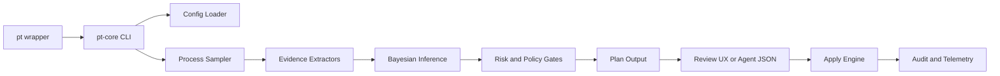

# Architecture Overview

`pt` uses a Bash wrapper for installation/update/discovery and delegates inference + execution to `pt-core` (Rust).

## Dataflow

Raw source for the diagram: `docs/architecture/flow.mmd`.

## Components

- `pt`: thin wrapper for binary lookup, install/update ergonomics.
- `pt-core`: command surface, inference, safety gates, report/session artifacts.
- `pt-config`: shared schemas + preset definitions.
- `pt-telemetry`: retention, shadow mode, and observability artifacts.

## Safety-Critical Boundaries

- Decisions are recommendations until explicit apply paths are invoked.
- Identity validation and protected pattern checks execute before signal dispatch.
- Robot/agent flows inherit policy-based constraints (posterior thresholds, kill caps, blast-radius limits).
